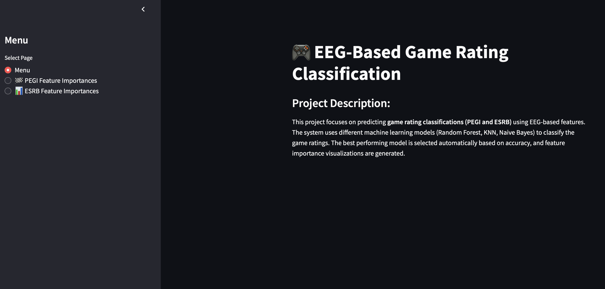
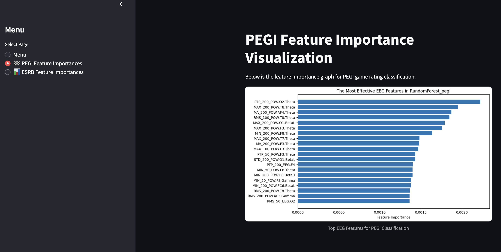
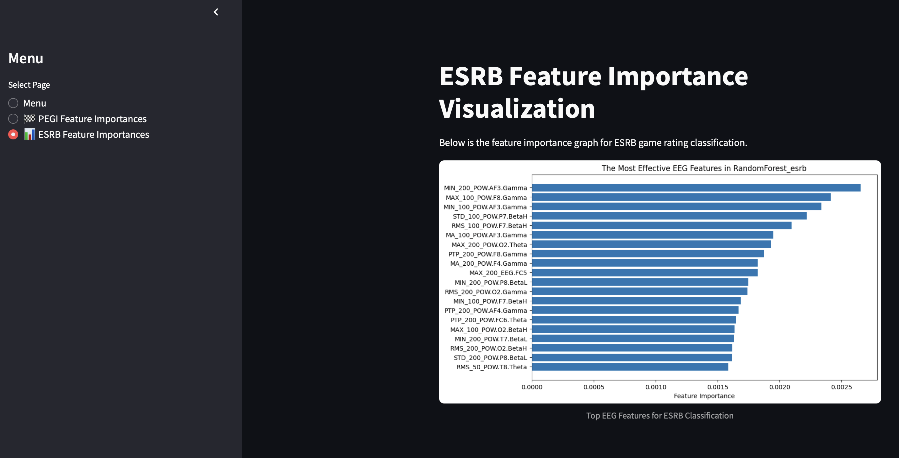

# 🎮 EEG-Based Game Rating Classification (PEGI & ESRB)

This project focuses on predicting **game rating classifications** (PEGI and ESRB) using **EEG-based features**.  
Machine learning models such as **Random Forest**, **K-Nearest Neighbors (KNN)**, and **Naive Bayes** are evaluated to select the best-performing algorithm for each classification task.  
The project also provides **feature importance visualizations** to highlight the most influential EEG features in the rating predictions.

---

## 📌 Project Overview

- 🎯 **Game Rating Classification:** Predicts PEGI and ESRB ratings using EEG signals.
- 🏆 **Model Selection:** Compares Random Forest, KNN, and Naive Bayes models; selects the best one automatically based on accuracy.
- 📊 **Feature Importance Analysis:** Visualizes the top EEG features that contribute most to the predictions.
- 🤖 **Outlier Detection:** (Currently placeholder, can be extended for anomaly detection.)

---

## ⚙️ Technologies Used

- 🐍 Python 3.x
- 📊 Streamlit (for interactive dashboard)
- 🌲 Scikit-learn (machine learning models)
- 🧮 Pandas, NumPy (data manipulation)
- 📉 Matplotlib (data visualization)

---

## 📂 Installation

1. Clone the repository:
   ```bash
   git clone https://github.com/your-username/eeg-game-rating-classification.git
   cd eeg-game-rating-classification
   ```

2. (Optional but recommended) Create and activate a virtual environment:
   ```bash
   python -m venv venv

   # For Linux/Mac:
   source venv/bin/activate

   # For Windows:
   venv\Scripts\activate
   ```

3. Install the required packages:
   ```bash
   pip install -r requirements.txt
   ```

---

## 🚀 How to Run

```bash
streamlit run main.py
```

The app will open in your default browser.  
Use the **sidebar menu** to navigate between:
- 📄 Menu (project description)
- 🏁 PEGI Feature Importances
- 📊 ESRB Feature Importances
- 🤖 Outlier Detection (placeholder)

---

## 🖼️ Demo Screenshots

### 🟢 Menu Page (Project Overview):


---

### 🟡 PEGI Feature Importance Visualization:


---

### 🔵 ESRB Feature Importance Visualization:


---

## 📂 Project Structure

```
├── main.py                                # Streamlit app (visualization)
├── game_rating_classification.py          # Machine learning logic and model training
├── model_results                          # Each feature's importance visualization
├── 04-EEG-Based Game Rating Classification (PEGI & ESRB).xlsx  # Input data file
├── requirements.txt                       # Required Python packages
├── README.md                              # Project description (this file)
└── media                                  # Program  Demo
```

---

## ⚠️ Notes

- The visualizations (`kmeans_model_*.png`) are **pre-generated** and directly displayed in the app.
- **Model training is not triggered from the Streamlit app**; only the PNG visualizations are shown.

---

